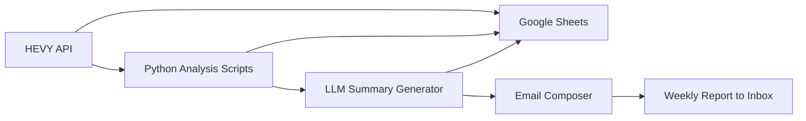

```markdown
```

# 🏋️‍♂️ AI-Powered Fitness Insights from HEVY App Data

> *Turn your workout logs into intelligent, data-driven fitness reports using Python, LLMs, and automation.*

<p align="center">
  
  
  
  
  
</p>

---

## 🧠 Project Overview

This capstone project connects your **HEVY workout logs** to an automated analytics pipeline that:

1. Fetches exercise data via the **HEVY API**
2. Stores and updates it in **Google Sheets**
3. Analyzes training patterns, volume, and focus areas
4. Generates natural-language summaries via an **LLM API**
5. Emails you personalized weekly/monthly fitness reports — complete with charts and AI commentary

---

## 🎯 Project Objectives

| Goal                | Description                                              |
| ------------------- | -------------------------------------------------------- |
| 📡 Data Integration | Fetch and store HEVY data automatically in Google Sheets |
| 📊 Analytics        | Compute training volume, frequency, and trends           |
| 🧠 NLP Insights     | Generate human-like summaries using LLM APIs             |
| 📈 Visualization    | Create workout dashboards and progress charts            |
| 📬 Automation       | Deliver weekly email reports with text + visuals         |

---

## 🧩 Tech Stack

| Component                          | Technology                                 |
| ---------------------------------- | ------------------------------------------ |
| **Backend Logic**                  | Python                                     |
| **Data Fetching**                  | HEVY API (`requests`)                      |
| **Data Storage**                   | Google Sheets (`gspread`)                  |
| **Analytics & Visualization**      | Pandas, Matplotlib / Plotly                |
| **Natural Language Summarization** | Gemini API / DeepSeek / OpenAI (Free Tier) |
| **Email Automation**               | `smtplib` / Gmail API                      |
| **Task Scheduling**                | Cron / Google Apps Script / PythonAnywhere |

---

## 🗂 Folder Structure

```bash
ai-fitness-insights/
├── data/
│   ├── workouts_raw.json
│   ├── workouts_clean.csv
│   ├── metrics_summary.csv
├── src/
│   ├── fetch_hevy_data.py
│   ├── analyze_workouts.py
│   ├── llm_summary.py
│   ├── email_report.py
│   ├── main.py
│   ├── helpers/
│   │   ├── clean_hevy_data.py
│   │   └── save_to_gsheets.py
├── visuals/
│   ├── volume_trend.png
│   ├── focus_piechart.png
│   ├── report_sample.png
├── notebooks/
│   ├── exploration.ipynb
├── README.md
├── requirements.txt
└── LICENSE
```

---

## 🧮 Dataset Schema

| Field      | Description                                       | Example             |
| ---------- | ------------------------------------------------- | ------------------- |
| `date`     | Date of the workout (YYYY-MM-DD)                  | 2025-10-30          |
| `title`    | Name or title of the workout session              | Upper Body Strength |
| `exercise` | Exercise performed in this set                    | Bench Press         |
| `duration` | Duration of the workout or session (in minutes)   | 60.5                |
| `weight`   | Weight used in this set (kg)                      | 55.0                |
| `reps`     | Number of repetitions in this set                 | 10                  |
| `distance` | Distance covered (if applicable, in meters or km) | 0.0                 |
| `id`       | Unique set identifier from HEVY API               | set_abc123          |

---
# 📊 Workout Data Analysis Plan

The goal of the `analyze_workouts.py` module is to uncover patterns, progress, and insights from HEVY workout data.  
This phase focuses on understanding training volume, intensity, frequency, and overall progression trends.

---

## 🏋️‍♂️ Volume & Intensity Tracking

These metrics quantify how much total work is being performed and how your training load evolves.

| Metric                          | Description                                                                 |
|---------------------------------|-----------------------------------------------------------------------------|
| Total Volume per Day            | `Sum(Weight × Reps)` grouped by `Date` — overall workload per day.         |
| Volume per Exercise             | `Weight × Reps` grouped by `Exercise` — identifies your heaviest contributors. |
| Average Weight per Rep per Exercise | `Weight ÷ Reps` averaged per `Exercise` — gauges workout intensity.     |
| Total Reps (Daily/Weekly/Monthly) | Tracks endurance and overall workload trends.                           |
| Workout Duration per Session    | Total `Duration` per `Title` or `Date`.                                    |
| Average Load per Workout        | Mean `Weight` lifted per workout session.                                  |
| Top 5 Highest Volume Days       | Identify peak training days for recovery balance.                          |

---

## 📈 Progress & Trend Analysis

These metrics evaluate improvements over time and highlight consistency or plateauing.

| Metric                          | Description                                                                 |
|---------------------------------|-----------------------------------------------------------------------------|
| Weekly Weight Progression per Exercise | Average or max `Weight` per `Exercise` by week — track progressive overload. |
| Reps Progression per Exercise   | Average `Reps` trend over time — monitors stamina and endurance gains.     |
| Weight × Reps Trend             | Proxy for total effort per `Exercise` — plotted weekly to visualize growth. |
| Exercise Frequency Trend        | How often each `Exercise` appears per week or month — identifies focus or neglect. |
| New vs. Repeated Exercises      | Detect variety in workouts vs. routine repetition.                         |
| Streak Tracking                 | Consecutive workout days — helps measure discipline.                       |
| Rest Day Detection              | Identify gaps between sessions to balance recovery.                        |

---

## 🧠 Technique & Efficiency Metrics

These measure how effectively workouts are structured and executed.

| Metric                          | Description                                                                 |
|---------------------------------|-----------------------------------------------------------------------------|
| Average Duration per Exercise   | Highlights exercises that take longer than expected.                       |
| Reps per Minute                 | `Reps ÷ Duration` — estimates pacing.                                      |
| Weight per Minute               | `(Weight × Reps) ÷ Duration` — indicates workout intensity over time.      |
| Distance Tracking (for cardio)  | Total `Distance` per workout when `Distance > 0`.                          |
| Volume per Minute               | Combines workload and time — helps assess training density.                |
| Set Density                     | Number of sets completed per minute or per workout duration.               |

---

## 🧪 Advanced Insights & Comparisons

These deeper analyses help you spot patterns, imbalances, and efficiency issues.

| Metric                          | Description                                                                 |
|---------------------------------|-----------------------------------------------------------------------------|
| Push vs. Pull Day Comparison    | Compare total volume, duration, and load across push/pull workouts.        |
| Muscle Group Analysis           | Group exercises manually (Chest, Legs, Back, etc.) and compare volume distribution. |
| Plateau Detection               | Identify weeks where `Weight` or `Reps` show little to no growth.          |
| Overtraining Signals            | Detect abnormally high volume/duration days that may suggest fatigue.      |
| Workout Diversity Index         | Ratio of unique exercises to total exercises — measures variety.           |
| Performance Consistency         | Standard deviation of `Volume` or `Reps` over time — measures stability.   |
| Progress vs Fatigue Correlation| Compare recent volume spikes with reduced `Reps` or `Weights`.             |

---

## ⚙️ How It Works



---

## 📊 Example Weekly Report

```
Subject: 🏋️ Weekly Fitness Insights (Oct 21–27)

You completed 5 workouts this week with a total training volume of 48,200 lbs.
Upper body accounted for 62% of your work, led by Bench Press and Shoulder Press.
Your PR for Deadlift improved by 8%.
Leg training frequency dipped slightly — consider adding one lower body day.

Top 3 Exercises:
1. Bench Press – 12 sets, 9,600 lbs total
2. Lat Pulldown – 8 sets, 6,400 lbs
3. Deadlift – 5 sets, 7,000 lbs

📈 Keep it up! You’re building strength and consistency.
```

---

## 📈 Example Visualization

<p align="center">
  
  
</p>

---

## 🔧 Installation & Setup

```bash
git clone https://github.com/<your-username>/ai-fitness-insights.git
cd ai-fitness-insights
pip install -r requirements.txt
```

### Add Credentials

* `.env` → store HEVY API key
* `credentials.json` → Google Sheets credentials
* Environment variables → Gmail SMTP login

Run:

```bash
python src/main.py
```

---

## 🧱 requirements.txt

```
requests==2.32.3
pandas==2.2.3
numpy==2.1.2
matplotlib==3.9.2
plotly==5.24.1
gspread==6.1.2
oauth2client==4.1.3
python-dotenv==1.0.1
openai==1.50.2
google-generativeai==0.7.2
deepseek==0.3.1
smtplib2==1.1.0
email-validator==2.2.0
```

---

## 📬 Automation Options

| Platform                         | Method                         |
| -------------------------------- | ------------------------------ |
| **Google Apps Script**           | Schedule daily/weekly triggers |
| **PythonAnywhere / Replit**      | Run recurring jobs             |
| **Local Cron Job (Linux/macOS)** | Automate with `crontab`        |
| **Windows Task Scheduler**       | Schedule local Python scripts  |

---

## 💡 Author

**Abhineet**
📧 [[abhineet.singh.2017@gmail.com](mailto:abhineet.singh.2017@gmail.com)]
🌐 [[LinkedIn](https://www.linkedin.com/in/singhabhineet/) / [GitHub](https://github.com/AbhiCogito)]

```
```

---
