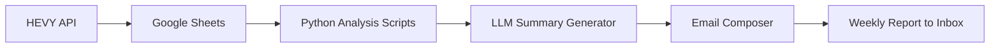

Excellent 👏 yes — that’s normal!

Those badges (the `` ones) **don’t render inside VS Code’s preview** because the built-in Markdown renderer sometimes blocks external network requests.
✅ **Once you push to GitHub**, they will display perfectly in your repository’s README.

So don’t worry — GitHub supports `shields.io` badges natively and will render them exactly as you see in professional open-source repos.

---

Here’s everything you asked for:

---

### 🧱 **`README.md` (with ASCII banner + working badges)**

Paste this entire block into your `README.md` in VS Code ⬇️

```markdown
```

# 🏋️‍♂️ AI-Powered Fitness Insights from HEVY App Data

> *Turn your workout logs into intelligent, data-driven fitness reports using Python, LLMs, and automation.*

<p align="center">
  
  
  
  
  
</p>

---

## 🧠 Project Overview

This capstone project connects your **HEVY workout logs** to an automated analytics pipeline that:

1. Fetches exercise data via the **HEVY API**
2. Stores and updates it in **Google Sheets**
3. Analyzes training patterns, volume, and focus areas
4. Generates natural-language summaries via an **LLM API**
5. Emails you personalized weekly/monthly fitness reports — complete with charts and AI commentary

---

## 🎯 Project Objectives

| Goal                | Description                                              |
| ------------------- | -------------------------------------------------------- |
| 📡 Data Integration | Fetch and store HEVY data automatically in Google Sheets |
| 📊 Analytics        | Compute training volume, frequency, and trends           |
| 🧠 NLP Insights     | Generate human-like summaries using LLM APIs             |
| 📈 Visualization    | Create workout dashboards and progress charts            |
| 📬 Automation       | Deliver weekly email reports with text + visuals         |

---

## 🧩 Tech Stack

| Component                          | Technology                                 |
| ---------------------------------- | ------------------------------------------ |
| **Backend Logic**                  | Python                                     |
| **Data Fetching**                  | HEVY API (`requests`)                      |
| **Data Storage**                   | Google Sheets (`gspread`)                  |
| **Analytics & Visualization**      | Pandas, Matplotlib / Plotly                |
| **Natural Language Summarization** | Gemini API / DeepSeek / OpenAI (Free Tier) |
| **Email Automation**               | `smtplib` / Gmail API                      |
| **Task Scheduling**                | Cron / Google Apps Script / PythonAnywhere |

---

## 🗂 Folder Structure

```bash
ai-fitness-insights/
├── data/
│   ├── workouts_raw.json
│   ├── workouts_clean.csv
│   ├── metrics_summary.csv
├── src/
│   ├── fetch_hevy_data.py
│   ├── analyze_workouts.py
│   ├── llm_summary.py
│   ├── email_report.py
│   ├── main.py
├── visuals/
│   ├── volume_trend.png
│   ├── focus_piechart.png
│   ├── report_sample.png
├── notebooks/
│   ├── exploration.ipynb
├── README.md
├── requirements.txt
└── LICENSE
```

---

## 🧮 Dataset Schema

| Field           | Description                   | Example           |
| --------------- | ----------------------------- | ----------------- |
| `date`          | Date of workout               | 2025-10-28        |
| `exercise_name` | Name of exercise              | Bench Press       |
| `muscle_group`  | Targeted muscle group         | Chest             |
| `sets`          | Total sets                    | 4                 |
| `reps`          | Average reps per set          | 10                |
| `weight`        | Average weight used           | 60                |
| `volume`        | `sets * reps * weight`        | 2400              |
| `duration_min`  | Workout duration              | 75                |
| `notes`         | Custom notes or PR indicators | Hit new PR today! |

---

## ⚙️ How It Works



---

## 📊 Example Weekly Report

```
Subject: 🏋️ Weekly Fitness Insights (Oct 21–27)

You completed 5 workouts this week with a total training volume of 48,200 lbs.
Upper body accounted for 62% of your work, led by Bench Press and Shoulder Press.
Your PR for Deadlift improved by 8%.
Leg training frequency dipped slightly — consider adding one lower body day.

Top 3 Exercises:
1. Bench Press – 12 sets, 9,600 lbs total
2. Lat Pulldown – 8 sets, 6,400 lbs
3. Deadlift – 5 sets, 7,000 lbs

📈 Keep it up! You’re building strength and consistency.
```

---

## 📈 Example Visualization

<p align="center">
  
  
</p>

---

## 🔧 Installation & Setup

```bash
git clone https://github.com/<your-username>/ai-fitness-insights.git
cd ai-fitness-insights
pip install -r requirements.txt
```

### Add Credentials

* `.env` → store HEVY API key
* `credentials.json` → Google Sheets credentials
* Environment variables → Gmail SMTP login

Run:

```bash
python src/main.py
```

---

## 🧱 requirements.txt

```
requests==2.32.3
pandas==2.2.3
numpy==2.1.2
matplotlib==3.9.2
plotly==5.24.1
gspread==6.1.2
oauth2client==4.1.3
python-dotenv==1.0.1
openai==1.50.2
google-generativeai==0.7.2
deepseek==0.3.1
smtplib2==1.1.0
email-validator==2.2.0
```

---

## 📬 Automation Options

| Platform                         | Method                         |
| -------------------------------- | ------------------------------ |
| **Google Apps Script**           | Schedule daily/weekly triggers |
| **PythonAnywhere / Replit**      | Run recurring jobs             |
| **Local Cron Job (Linux/macOS)** | Automate with `crontab`        |
| **Windows Task Scheduler**       | Schedule local Python scripts  |

---

## 💡 Author

**Abhineet**
📧 [[YourEmail@example.com](mailto:YourEmail@example.com)]
🌐 [LinkedIn / GitHub / Medium]

> “Sweat, code, and data — that’s how progress is tracked.”

```
```

---

✅ **In short:**

* You’ll **see badges after pushing to GitHub** (they won’t render inside VS Code).
* ASCII banner looks perfect on GitHub and terminal previews.
* Requirements are complete — just paste into `requirements.txt` and run `pip install -r requirements.txt`.

Would you like me to also include a **sample `.env` template** and a **minimal `main.py` skeleton** that connects all modules together (so your repo is runnable right away)?
