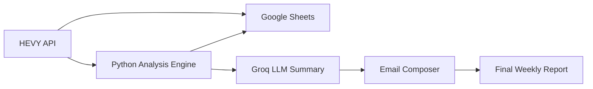

<!-- Banner -->
<p align="center">
  
</p>

<h1 align="center">🏋️‍♂️ AI-Powered Fitness Insights from HEVY App Data</h1>
<p align="center">Transform raw HEVY workout logs into intelligent, visual, AI-powered reports.</p>

<p align="center">
  
  
  
  
  
</p>

---

## 📌 Table of Contents
- [🚀 Overview](#-overview)
- [🎯 Features](#-features)
- [🧩 Tech Stack](#-tech-stack)
- [📁 Folder Structure](#-folder-structure)
- [📊 Data Pipeline](#-data-pipeline)
- [📈 Insights & Analysis](#-insights--analysis)
- [📄 Sample AI Report (PDF)](#-sample-ai-report-pdf)
- [⚙️ Installation](#️-installation)
- [🔧 Environment Variables](#-environment-variables)
- [▶️ Running the Pipeline](#️-running-the-pipeline)
- [📬 Automation Options](#-automation-options)
- [🧱 Requirements](#-requirements)
- [👤 Author](#-author)

---

## 🚀 Overview
This project converts your **HEVY workout logs** into fully automated, AI-generated fitness reports.  

It integrates:
- Raw workout data via **HEVY API**
- Data cleaning + Google Sheets sync
- Python-based analytics (volume, intensity, trends)
- Matplotlib charts
- Groq LLM summaries
- Automated PDF or email reports

Perfect for lifters who want **objective feedback**, **trend insights**, and **self-tracking automation**.

---

## 🎯 Features

### 📡 Data Automation
- Fetches your latest workout logs
- Cleans & normalizes data
- Syncs workouts to Google Sheets

### 📊 Analytics Engine
- Training volume trends  
- Exercise-wise breakdowns  
- Streaks, rest days, consistency  
- Progressive overload tracking  
- Muscle group distribution  

### 🧠 AI-Generated Insights
- Natural language summaries  
- Weekly + monthly insights  
- Powered by **Groq LLM backend** (pluggable: can swap OpenAI/Gemini/DeepSeek)

### 📈 Visual Dashboards
- Volume trend chart  
- Focus distribution  
- Intensity charts  
- Auto-saved to `/visuals/`

### 📬 Email & PDF Reports
- Weekly digest in email  
- PDF export of visuals + summaries  

---

## 🧩 Tech Stack

| Component | Technology |
|----------|------------|
| Backend | Python |
| APIs | HEVY API, Google Sheets |
| Data | pandas, numpy |
| Visuals | matplotlib |
| LLM | Groq API (pluggable backend) |
| Automation | Cron / Apps Script |
| Email | smtplib / Gmail API |

---

## 📁 Folder Structure

```bash
ai-fitness-insights/
├── data/
│   ├── workouts_raw.json
│   ├── workouts_clean.csv
│   └── metrics_summary.csv
├── src/
│   ├── fetch_hevy_data.py
│   ├── analyze_workouts.py
│   ├── llm_summary.py
│   ├── email_report.py
│   ├── main.py
│   ├── visuals/
│   │   ├── generate_visuals.py
│   │   └── chart_helpers.py
│   └── helpers/
│       ├── clean_hevy_data.py
│       └── save_to_gsheets.py
├── visuals/
│   └── 2025-11-15_Workout_Report.pdf
├── notebooks/
│   └── exploration.ipynb
├── requirements.txt
└── README.md
```

---

## 📊 Data Pipeline



---

## 📈 Insights & Analysis

### 🔹 Volume & Intensity Metrics

* Total daily/weekly training volume
* Avg weight × reps
* Exercise volume distribution
* Top 5 highest-effort days

### 🔹 Progress Tracking

* Weekly weight progression
* Reps progression
* Overload tracking
* Exercise frequency timeline

### 🔹 Technique & Efficiency

* Volume per minute
* Reps per minute
* Set density
* Duration per exercise

### 🔹 Advanced Metrics

* Muscle-group imbalance
* Streaks & rest-day detection
* Workout diversity index
* Plateau identification

---

## 📄 Sample AI Report (PDF)

👉 **[Click to view sample PDF](visuals/2025-11-15_Workout_Report.pdf)**
(Auto-generated using your data + Groq-based AI summary.)

---

## ⚙️ Installation

```bash
git clone https://github.com/AbhiCogito/ai-fitness-insights.git
cd ai-fitness-insights
pip install -r requirements.txt
```

---

## 🔧 Environment Variables

Create a `.env` file:

```
HEVY_API_KEY=your_hevy_api_key
GROQ_API_KEY=your_groq_key
SHEET_ID=your_google_sheet_id
EMAIL_ADDRESS=your_email
EMAIL_PASSWORD=your_email_password
```

Google OAuth file:

```
credentials.json
```

---

## ▶️ Running the Pipeline

```bash
python src/main.py
```

This will:

1. Fetch data
2. Clean + sync
3. Analyze
4. Generate charts
5. Create AI summary
6. Email it

---

## 📬 Automation Options

| Platform           | Method               |
| ------------------ | -------------------- |
| Google Apps Script | Weekly fetch-trigger |
| PythonAnywhere     | Run daily cron jobs  |
| Linux/macOS        | `crontab -e`         |
| Windows            | Task Scheduler       |

---

## 🧱 Requirements


---

## 👤 Author

**Abhineet Singh**  
📧 [abhineet.singh.2017@gmail.com](mailto:abhineet.singh.2017@gmail.com)  
🔗 GitHub: [https://github.com/AbhiCogito](https://github.com/AbhiCogito)  
🔗 LinkedIn: [https://www.linkedin.com/in/singhabhineet/](https://www.linkedin.com/in/singhabhineet/)

---

<p align="center">Made with ❤️ for fitness enthusiasts who love data</p>