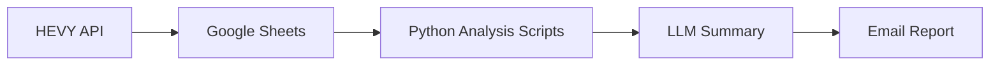

# ✅ **Capstone Project Execution Plan**

## 🏋️ *Project: AI-Powered Fitness Insights from HEVY App Data*

---

## **PHASE 1 — Setup & Planning**

### 🎯 1. Define Project Scope

* [ ] Finalize key use cases (weekly summary, trend detection, focus analysis).
* [ ] Pick your initial tech stack:

  * **Python** (main logic)
  * **gspread** (Google Sheets API)
  * **requests** (HEVY API)
  * **pandas, matplotlib/plotly** (analysis + charts)
  * **LLM API** (Gemini, DeepSeek, or OpenAI free tier)
  * **smtplib or Gmail API** (email automation)

### 🗂 2. Create GitHub Repo

* [ ] Repo name: `ai-fitness-insights`
* [ ] Add `README.md` (basic outline now, fill later)
* [ ] Add `.gitignore` (`__pycache__`, API keys, credentials.json)
* [ ] Add `requirements.txt` for dependencies

**Folder Structure:**

```
ai-fitness-insights/
├── data/
│   ├── workouts_sample.json
│   ├── sheets_data.csv
├── src/
│   ├── fetch_hevy_data.py
│   ├── analyze_workouts.py
│   ├── llm_summary.py
│   ├── email_report.py
│   ├── main.py
├── notebooks/
│   ├── exploration.ipynb
├── visuals/
│   ├── trends.png
│   ├── dashboard.png
├── README.md
├── requirements.txt
└── LICENSE
```

---

## **PHASE 2 — Data Layer**

### 🔌 3. Fetch Workout Data

* [ ] Get **HEVY API key** and test simple GET request.
* [ ] Store raw response → `data/workouts_raw.json`.
* [ ] Write a script `fetch_hevy_data.py` to:

  * Pull recent workouts
  * Clean and normalize (dates, exercises, sets, reps, weights)
  * Push into Google Sheet (using `gspread`).

### 📊 4. Define Data Schema

Create a standard table:

| Date | Exercise | Muscle Group | Sets | Reps | Weight | Volume | Duration(min) |
|------|-----------|---------------|------|------|---------|----------------|

* [ ] Add optional `notes` or `isPR` columns.
* [ ] Document this schema in `README.md`.

---

## **PHASE 3 — Analytics Layer**

### 🧮 5. Core Calculations

* [ ] Compute:

  * Total sets/reps/volume per week
  * Volume per muscle group
  * Workout frequency
  * Average rest days
* [ ] Save as `metrics_summary.csv`.

### 🧠 6. NLP / LLM Insights

* [ ] Feed key metrics into an LLM prompt:

  ```
  "Summarize the user's workout performance for the week based on:
   total volume, frequency, top 3 exercises, and muscle group focus."
  ```
* [ ] Generate a 4–6 line natural language summary.
* [ ] Save to file or directly email.

---

## **PHASE 4 — Visualization & Reporting**

### 📈 7. Visual Dashboards

* [ ] Use matplotlib/plotly for:

  * Volume trend over time
  * Muscle group focus pie chart
  * Workout frequency heatmap
* [ ] Export PNGs → `/visuals`.

### 📧 8. Email Automation

* [ ] Create an HTML email with:

  * Summary paragraph (LLM)
  * Key stats table
  * Embedded charts
* [ ] Send weekly via:

  * Python `smtplib`, or
  * Schedule with cron / Google Apps Script

---

## **PHASE 5 — Polish & Documentation**

### 📜 9. Write Final README.md

Include:

* ✅ Project overview
* 🧠 Objectives & key features
* ⚙️ Tech stack
* 📁 Folder structure
* 📊 Sample output
* 🔑 How to run
* 📬 Example report (screenshots)

**README Template Snippet:**

```markdown
# AI-Powered Fitness Insights from HEVY App Data

An automation project that turns raw workout logs into intelligent summaries using
Python, the HEVY API, and LLMs. It analyzes your exercise history, tracks trends,
and emails you natural-language insights weekly.

## 🧩 Workflow
1. Fetch data from HEVY → Google Sheet
2. Analyze metrics (volume, frequency, PRs)
3. Generate AI-written summary
4. Email personalized report with charts


```

### 🧱 10. Add Workflow Diagram

Use [draw.io](https://app.diagrams.net/) or [mermaid](https://mermaid-js.github.io/) syntax in README:



---

## **PHASE 6 — Showcase & Career Boost**

### 🌍 11. Public Demo Assets

* [ ] Record a **2-minute Loom demo** showing:

  * Script execution
  * Example report email
* [ ] Write a **Medium / LinkedIn post**:

  * “How I used my own workout data to build an AI fitness dashboard.”
* [ ] Add project link to GitHub profile pinned repos.

### 💼 12. Skill Keywords to Highlight

> `Python`, `API Integration`, `Data Analytics`, `LLM`,
> `Automation`, `Google Sheets API`, `Data Visualization`, `AI Reporting`

---

## ⚙️ **Optional Enhancements (Future)**

* [ ] Add Apple Health / Strava integration.
* [ ] Build a Streamlit dashboard version.
* [ ] Train a lightweight local model for pattern prediction.
* [ ] Create “consistency score” or leaderboard among friends.

---

Would you like me to now draft the **README.md content (GitHub-ready version)** — complete with logo banner, tech badges, workflow diagram, dataset schema table, and example output section?
It’ll be ready for you to paste directly into your repo.
